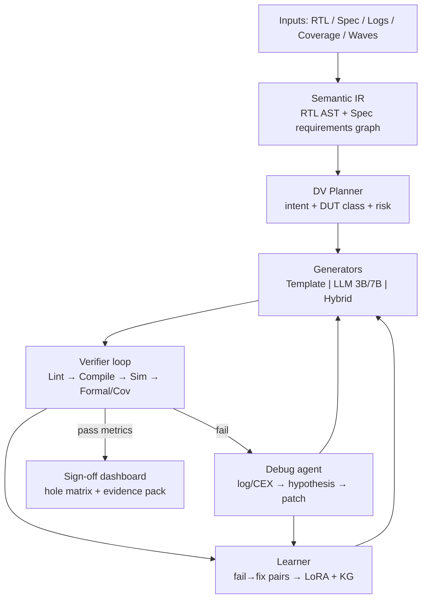

# ChipSutra Advanced DV Architecture (30 / 60 / 90)

**North star:** ChipSutra is an **AI verification copilot** that can (progressively) generate testbenches for arbitrary RTL, Spec→RTL from structured specs, debug verification failures, and drive **sign-off readiness** workflows — locally, with open tools first.

**Honest boundary:** Community Edition targets laptop + Verilator/Yosys/SBY + local LLM. Full vendor sign-off (Questa/VCS/Xcelium, UCDB/FSDB, LSF farms, SAML) stays Enterprise. “Any design / any spec” is the **capability target via architecture**, not a claim that 3B Ollama already matches Claude on multi-million-gate SoCs.

Last updated: 2026-08-01

---

## 1. Target capability map (verification sign-off)

| Sign-off pillar | Product capability | Architecture component |
|-----------------|--------------------|------------------------|
| Stimulus / TB | TB for arbitrary DUT ports & protocols | DUT IR → Planner → Template library + LLM |
| Checking | SVA, checkers, scoreboards | Protocol packs + golden models |
| Coverage | Functional + code; hole→test loop | Coverage adapters + closure planner |
| Spec fidelity | Spec→RTL + Spec→TB/assertions | Spec IR (requirements graph) |
| Debug | Log/CEX/wave → root cause + fix | Debug agent + tool_log repair loop |
| Lint / CDC / RDC | Policy + analyze + waive | Lint policy + CDC engine |
| Formal | Properties + CEX harvest | SBY path + property table |
| Synth / LEC / STA | Sanity before tapeout gates | Yosys / eqy / OpenSTA |
| Regression | Seeded matrix + trends | Regression workers + manifests |
| Evidence | Reproducible runs for audit | Run manifests, hashes, artifacts |
| Learning | Improve from fails | Eval harness → LoRA / KG updates |

---

## 2. Target architecture (advanced)

### Core modules (to build / extend)

| Module | Path (planned / existing) | Job |
|--------|---------------------------|-----|
| RTL IR | `backend/rtl_ir.py` (new) + richer `rtl_ports.py` | Ports, params, clocks/resets, interfaces, FSM hints |
| Spec IR | `backend/spec_ir.py` (new) | Requirements, I/O, clocks, modes from markdown/PDF text |
| DV Planner | `backend/dv_planner.py` (new) | Route: skeleton vs LLM vs hybrid; module pack |
| Protocol packs | `backend/knowledge/` + `tb_skeleton.py` | Counter/FIFO/AXI/… → expand endlessly |
| Generators | `server.py` `/generate/stream` | TB, SVA, CG, Spec2RTL, checkers, holes, debug |
| Model router | `backend/llm_router.py` (new) | 3B / 7B / cloud fallback by task size |
| Verifier | `backend/dv_verify.py` (new) | Lint + Verilator compile/run score |
| Debug agent | extend debug module + `tool_log` | Ranked causes + regenerate patch |
| Sign-off board | `backend/signoff.py` + UI (new) | Checklist, evidence, residual risk |
| Eval harness | `backend/scripts/dv_eval_suite.py` (new) | Golden accuracy + latency SLOs |
| Learner | ChipSutra-VLSI-LLM LoRA pipeline | Curated JSONL from fails |

---

## 3. 30 / 60 / 90 day plan

### Days 0–30 — “Prove any block smoke” (foundation)

**Goal:** Architecture spine exists; TB path is IR→plan→generate→verify for common + generic DUTs.

| Work item | Deliverable |
|-----------|-------------|
| DV Planner | Classify DUT + choose engine; wire into `/generate/stream` |
| Soft RTL IR | Params, clocks/resets, protocol tags beyond regex ports |
| Verifier loop v0 | After TB gen: lint + optional Verilator compile; store result on generation | ✅ `dv_verify.py` + generate stream |
| Eval suite v0 | Golden DUT matrix (counter/FIFO/AXI/parity + 2 generics); CI-able script | ✅ `scripts/dv_eval_suite.py` |
| Model router v0 | Task → 3B vs 7B env flag; pre-warm Ollama on API startup | ✅ `llm_router.py` |
| Stream UX | Progress events while LLM buffers (or true token stream) | ✅ SSE `progress` + UI status |
| Spec2RTL guardrails | Spec checklist (clocks, resets, I/O table) before generate; mark 🧪 | ✅ `spec_checklist.py` + generate stream |
| Debug pack v0 | Structured parse of Verilator/UVM_ERROR → ranked templates | ✅ `debug_classify.py` + generate stream |
| Any-DUT auto TB | Protocol packs + universal random/no-X harness for unknown RTL | ✅ mux/APB/stream + generic in `tb_skeleton.py` |
| Platform | Mongo health in `/health`; document Atlas `0.0.0.0/0` or local Mongo |

**Exit criteria:** Eval suite ≥ existing SOLID rates; unknown DUT still gets legal TB + compile attempt; planner metrics logged.

### Days 31–60 — “Close the loop” (accuracy)

**Goal:** Failures feed repair; Spec and Debug feel product-grade; more protocols.

| Work item | Deliverable |
|-----------|-------------|
| Auto-repair | Verifier fail → inject log → regenerate ≤N times |
| Protocol packs | APB, AHB-lite, AXIS, simple UART/SPI skeletons | APB + mux + stream started in skeleton; AHB/UART/SPI next |
| Spec IR v1 | Extract requirements IDs → RTL ports + SVA stubs |
| Coverage→TB | Hole plan already exists → bind planner + verify |
| Sign-off checklist v0 | API + UI: lint/CDC/cov/formal/synth/STA status tiles |
| RAG upgrade | Optional embeddings; pin protocol pack retrieval |
| Few-shot / LoRA dataset | Export lint-fail→fixed pairs; first LoRA experiment doc |
| Latency | GPU compose profile; cold-start pre-warm |

**Exit criteria:** End-to-end “upload RTL → TB → sim PASS” on ≥8 goldens; debug module proposes actionable next step from real logs.

### Days 61–90 — “Sign-off readiness” (breadth)

**Goal:** Verification manager view; evidence packs; path to Enterprise adapters.

| Work item | Deliverable |
|-----------|-------------|
| Sign-off dashboard | Residual risk, open holes, waiver board, artifact ZIP |
| Formal pack | Property set from Spec IR + CEX→debug agent |
| Multi-file SoC IR | Hierarchy walk, interface map, CDC boundaries |
| UVM pack | Agent/env generation only when requested; Verilator SV fallback always offered |
| Eval dashboards | Nightly accuracy/latency published |
| Customer LoRA path | Documented fine-tune → Ollama tag `chipsutra-vlsi:*-ft` |
| Enterprise hooks | Abstract simulator adapter interface (stub Questa/VCS) |

**Exit criteria:** Project can export a **sign-off evidence pack**; eval trend not regressing; SoC demo (multi-module) TB + CDC + cov loop.

---

## 4. Module-by-module enhancements (product surface)

### Testbench (any design)
1. IR features → protocol score  
2. Known protocol → golden template  
3. Unknown → generic layered TB + LLM fill of scoreboard hooks  
4. Always verify compile; prefer skeleton on hard lint fail  

### Spec → RTL (any specification)
1. Spec checklist / IR (must: clocks, reset, I/O, modes)  
2. Generate RTL + companion TB + SVA from same IR  
3. Synth sanity (Yosys) as acceptance  
4. UI clearly experimental until IR coverage is high  

### Debug (any failure)
1. Classify: compile / elab / X-prop / assertion / scoreboard / timeout / cov  
2. Retrieve playbook chunk + wave/CEX hints  
3. Propose patch or regenerate with `tool_log`  
4. Store hypothesis accuracy via user thumbs  

### Sign-off features
- Lint policy + waivers (exists)  
- CDC/RDC (exists, deepen)  
- Coverage closure loop (exists, bind planner)  
- Formal CEX (exists, bind debug)  
- Regression matrix (exists)  
- Synth/LEC/STA (exists, deepen STA fixtures)  
- **New:** unified sign-off score + evidence export  

---

## 5. LLM layer strategy (ChipSutra-VLSI)

| Tier | Use |
|------|-----|
| Templates | Default for speed + correctness on known shapes |
| 3B | Fast local UVM sketches, debug hypothese, small repairs |
| 7B / GPU | Hard Spec2RTL, multi-agent UVM, long logs |
| LoRA-ft | Customer or ChipSutra DV corpus after day 60 |
| Cloud optional | Enterprise overflow only |

Accuracy = **IR + planner + verify**, not bigger SYSTEM prompts alone.

---

## 6. Metrics (competitive bar)

| Metric | 30-day target | 90-day target |
|--------|---------------|---------------|
| Golden TB SOLID (skeleton) | ≥5/5 | ≥12/12 |
| LLM TB lint-pass rate | ≥70% | ≥85% |
| TB Verilator compile-pass (goldens) | ≥80% | ≥95% |
| Skeleton latency p95 | <2s | <2s |
| LLM first progress event | <5s | streamed tokens |
| Debug: ranked cause useful (thumbs) | baseline | ≥60% up |
| Sign-off checklist completeness | N/A | all tiles wired |

---

## 7. What we will not pretend

- Replacing VCS/Questa sign-off simulators in Community  
- Inventing JEDEC/PCIe timing without user docs  
- Claiming continuous self-training inside Ollama without LoRA jobs  

---

## 8. Immediate next implementation (Phase 1 start)

1. `backend/dv_planner.py` — DUT/intent routing  
2. `backend/scripts/dv_eval_suite.py` — accuracy/latency harness  
3. Wire planner metadata into generation `learning{}`  
4. Keep Fast random default; LLM remains gated  

See also: [ENHANCEMENTS.md](./ENHANCEMENTS.md), [INDUSTRY_EDA_GAPS.md](./INDUSTRY_EDA_GAPS.md), [ROADMAP.md](../ROADMAP.md), ChipSutra-VLSI-LLM [ACCURACY_AND_KNOWLEDGE.md](../../ChipSutra-VLSI-LLM/docs/ACCURACY_AND_KNOWLEDGE.md).
